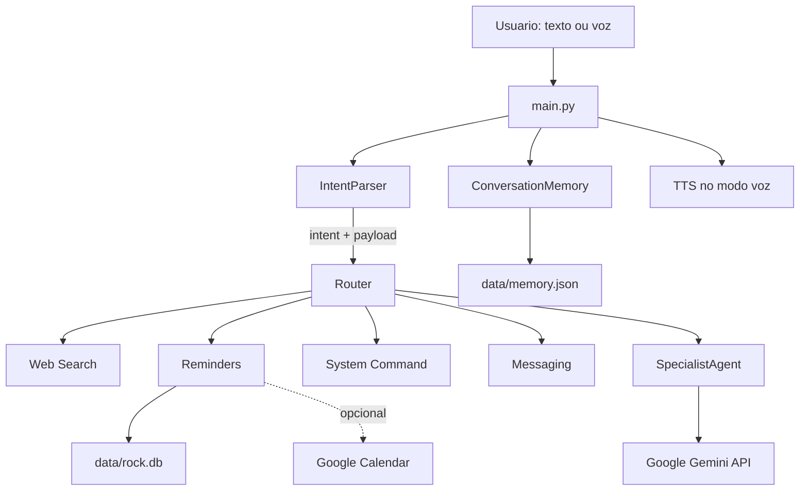

# Documentacao do Rock Assistant

Este documento descreve o funcionamento atual do projeto e a responsabilidade de cada arquivo dentro de `rock_assistant`.

## 1. Visao geral

O Rock Assistant e um assistente de terminal para Linux/Kali com cinco tipos de acao:

- conversa geral com a API do Google Gemini;
- pesquisa na web;
- criacao de lembretes;
- execucao de comandos locais;
- envio simulado de mensagens.

Ele pode ser usado em modo texto ou em modo voz. No modo voz, o Speech-to-Text (STT) transforma a fala em texto e o Text-to-Speech (TTS) transforma a resposta em audio.



## 2. Fluxo de uma mensagem

1. `main.py` cria a memoria, o parser, o especialista e o roteador.
2. O programa le uma entrada no terminal ou recebe uma frase do microfone.
3. A entrada e salva na memoria de curto prazo.
4. `IntentParser` identifica uma intencao e extrai um `payload` estruturado.
5. `Router` procura o manipulador registrado para aquela intencao.
6. A ferramenta executa a acao ou `SpecialistAgent` conversa com a API do Google Gemini.
7. O resultado e exibido e salvo como resposta do assistente.
8. No modo voz, a resposta completa e exibida/salva na memoria e uma versao tratada e enviada ao TTS.

As intencoes aceitas sao `search`, `reminder`, `command`, `message` e `general`.

Exemplos de payloads:

```text
busca documentacao Python
=> {"intent": "search", "payload": {"query": "documentacao Python"}}

lembre de estudar as 20:00
=> {"intent": "reminder", "payload": {"text": "estudar", "when": "as 20:00"}}

exec uname -a
=> {"intent": "command", "payload": {"command": "uname -a"}}
```

## 3. Arquivos e pastas

### `rock_assistant/config.py`

Centraliza configuracoes e caminhos do sistema. Ao ser importado, define a pasta `data` e a pasta `logs`, criando-as caso necessario.

Principais configuracoes:

- `GEMINI_API_KEY`: chave da API do Google Gemini;
- `GEMINI_MODEL_ROUTER`: modelo que pode classificar intencoes estruturadas via LLM, por padrao `gemini-2.0-flash-lite`;
- `GEMINI_MODEL_SPECIALIST`: modelo usado para conversa e tarefas tecnicas analiticas, por padrao `gemini-2.0-flash`;
- `LLM_ROUTER_ENABLED`: desativado por padrao; quando falso, o parser usa RegEx;
- `GEMINI_GENERATION_CONFIG`: parametros de temperatura e top_p para geracao;
- `GEMINI_TIMEOUT`: tempo limite de resposta para a API em segundos;
- `MEMORY_FILE`, `DB_PATH` e `MAX_MEMORY_MESSAGES`: persistencia e limite da memoria;
- `VOICE_ENABLED`, `STT_MODEL`, `TTS_RATE`, `TTS_VOLUME`, `VOICE_LANGUAGE`, `TTS_BACKEND`, `PIPER_COMMAND`, `PIPER_MODEL_PATH`, `TTS_PLAYER` e `TTS_TEMP_DIR`: configuracoes de voz;
- `get_credentials_path()` e `get_token_path()`: localizam credenciais do Google Calendar.

A maioria dos valores pode ser alterada por variaveis de ambiente.

### `rock_assistant/main.py`

E o ponto de entrada e o coordenador da aplicacao.

- `build_router()` registra cada intencao e a funcao que deve executa-la.
- `run_text_loop()` implementa o terminal interativo sem audio.
- `run_voice_loop()` captura fala, processa a intencao e reproduz a resposta.
- `main()` interpreta `-v`/`--voz`, cria os objetos principais e inicia o loop escolhido.

Ao iniciar, o Rock executa um briefing curto. Mensagens internas pendentes sem horario,
ou cujo horario ja venceu, sao contadas e ficam disponiveis para entrega. Uma mensagem
urgente e anunciada antes da saudacao. O usuario pode pedir para saber a origem ou ouvir
as mensagens; somente ao ouvir o conteudo elas passam para o estado `delivered`.

As saudacoes sao escolhidas aleatoriamente de uma lista fixa em
`rock_assistant/core/startup.py`. O modo texto e o modo voz usam o mesmo briefing.

Comandos especiais dos dois loops:

- `sair`, `exit` ou `quit`: encerra o programa;
- `limpar memoria`, `/clear` ou `clear memory`: apaga o historico persistido.

Execucao direta esperada:

```bash
python -m rock_assistant.main
python -m rock_assistant.main --voz
```

### `rock_assistant/core/intent_parser.py`

Converte texto livre em uma intencao e em parametros. O caminho padrao e deterministico:

1. comandos diretos de CLI e prefixos como `exec`;
2. buscas iniciadas por termos como `busca` ou `pesquisa`;
3. lembretes;
4. mensagens;
5. outros comandos de sistema;
6. conversa geral.

`parse()` faz essa classificacao com expressoes regulares e extrai campos como `query`, `when`, `target` e `command`.

`parse_with_llm()` usa o modelo `GEMINI_MODEL_ROUTER` da Google somente quando `LLM_ROUTER_ENABLED` esta ativo. Ele exige JSON, valida a intencao retornada e volta para `parse()` deterministico caso a API esteja indisponivel ou retorne erro.

`ping_gemini()` realiza um smoke test de ping-pong com a API do Gemini para validar conectividade e autenticacao.

### `rock_assistant/core/memory.py`

Define `ConversationMemory`, a memoria de curto prazo do assistente.

- guarda mensagens com `role` (`user` ou `assistant`) e `content`;
- carrega o historico de `data/memory.json` ao iniciar;
- salva automaticamente apos cada mensagem por padrao;
- limita o historico a `MAX_MEMORY_MESSAGES`, dez mensagens por padrao;
- funciona como uma janela deslizante, descartando as mensagens mais antigas;
- `clear_memory()` esvazia memoria e arquivo JSON.

O especialista usa as mensagens mais recentes ao montar o contexto enviado ao modelo.

### `rock_assistant/core/router.py`

Implementa um roteador pequeno e generico. `register(intent, handler)` associa uma intencao a uma funcao. `route(intent, payload)` executa essa funcao.

Ele nao interpreta texto nem conhece as ferramentas. Essa separacao deixa o parser responsavel pela decisao e o `main.py` responsavel pelo registro das acoes.

### `rock_assistant/core/specialist.py`

Define `SpecialistAgent`, o agente de conversa geral e tarefas tecnicas via Google Gemini SDK (`google-genai`).

O agente:

- envia chamadas estruturadas para o SDK do Gemini;
- usa `GEMINI_MODEL_SPECIALIST` e o prompt de sistema tecnico;
- inclui memoria recente formatada como turnos no histórico;
- trata chave ausente, quota excedida, bloqueio de seguranca e timeout sem derrubar o programa;
- pode ser usado diretamente pelo `Router` por implementar `__call__()`.

O prompt de sistema identifica explicitamente o Rock como assistente pessoal do usuario,
orientando respostas em portugues, objetivas, cuidadosas e baseadas no contexto real da
conversa.

### `rock_assistant/tools/web_search.py`

Implementa pesquisa externa.

`search_web_raw()` tenta, nesta ordem, DuckDuckGo via `DDGS`, uma query simplificada, a API Instant Answer do DuckDuckGo e a API de resumo da Wikipedia em portugues. Retorna uma lista estruturada com titulo, URL e resumo.

`search_web_structured()` coordena a busca com uma tentativa inicial de 7 segundos,
workers limitados e deadline global configuravel de 200 segundos. O modo `target`
pode escalar de 5 para 10 e 20 workers; o modo `bulk` usa o adaptador Scrapy com
ate 10 requisicoes concorrentes. O HTML pode ser enriquecido com `requests` e
BeautifulSoup; tabelas sao convertidas com `pandas.read_html` quando disponivel.
Os modos explicitos aceitos pelo parser sao `busca alvo especifico: ...` e
`busca em massa: ...`.

`search_web()` transforma essa lista em texto formatado para exibir no terminal. `WebSearchTool` oferece a mesma funcionalidade em formato orientado a objetos.

A ferramenta depende de acesso a internet para obter resultados reais.

### `rock_assistant/tools/reminders.py`

Gerencia lembretes locais e a possivel sincronizacao com o Google Calendar.

- `SQLiteReminderStorage` cria a tabela `reminders` e grava/lista registros em `data/rock.db`;
- `GoogleCalendarAdapter` carrega OAuth2 de `credentials.json`/`token.json` e cria eventos no calendario principal;
- `create_reminder()` grava primeiro no SQLite e depois tenta sincronizar;
- se o Google nao estiver configurado, o lembrete continua salvo localmente com status `created_local`;
- na interface, um lembrete criado com sucesso retorna apenas `Salvo`; detalhes técnicos permanecem no armazenamento e nos logs;
- `list_reminders()` lista os lembretes mais recentes;
- `list_pending_messages()` retorna mensagens internas vencidas ou sem horario;
- `mark_delivered()` registra a entrega depois que o conteudo e apresentado ao usuario;
- `ReminderTool` e um wrapper orientado a objetos.

O adaptador converte `when` em data e hora efetivas no Google Calendar. Expressões como `amanhã meio dia` ou `amanhã ao meio-dia` criam um evento com `dateTime` às 12:00; quando apenas uma data é informada, como `amanhã`, o evento continua sendo de dia inteiro.

### `rock_assistant/tools/system_cmd.py`

Executa comandos e diagnosticos do sistema Linux.

- `is_command_safe()` bloqueia alguns padroes destrutivos, como `rm` contra `/`, `mkfs`, `dd` para discos e fork bomb;
- `run_system_command()` executa com `shell=True`, captura saida e erro, aplica timeout e trata comandos ausentes;
- `launch_terminal()` procura terminais graficos instalados;
- `get_local_ip()` tenta socket UDP, `ip -4 addr` e hostname;
- `run_nmap_scan()` usa `nmap` quando disponivel ou testa um conjunto fixo de portas como fallback;
- `SystemCommandTool` agrupa essas funcoes em uma interface orientada a objetos.

Importante: a lista de bloqueios e limitada. Como existe `shell=True`, nao se deve tratar essa verificacao como uma sandbox completa. O programa deve ser executado com uma conta e permissoes adequadas.

### `rock_assistant/tools/messaging.py`

Define `send_message()` e `MessagingTool`. Atualmente nao envia nada para WhatsApp, Telegram, Slack ou outro servico: apenas devolve um dicionario com status `queued` e o payload que seria enviado.

### `rock_assistant/tools/stt.py`

Implementa Speech-to-Text.

- inicializa `SpeechRecognition` quando a dependencia esta disponivel;
- seleciona microfone por `MICROPHONE_INDEX` ou por nome;
- tenta capturar via PyAudio/SpeechRecognition;
- tenta transcrever com Whisper local;
- usa Google STT como fallback;
- se PyAudio/PortAudio falhar, tenta `arecord` ou `pw-record`;
- remove o WAV temporario depois da transcricao;
- `get_stt()` fornece uma instancia global reutilizavel.

Sem microfone ou dependencias de audio, `listen()` retorna uma string vazia e o modo voz passa a aceitar texto pelo terminal.

### `rock_assistant/tools/tts.py`

Implementa Text-to-Speech.

- usa Piper como backend principal, gerando WAV localmente e reproduzindo-o com `ffplay`, `mpv` ou `aplay`;
- mantém `pyttsx3` como último fallback quando o comando, modelo ou player do Piper não estiver disponível;
- permite configurar modelo, player, velocidade, volume e diretório temporário por variáveis de ambiente;
- mantém `speak()`, `stop()`, `is_available()` e `get_tts()` para preservar o contrato do modo voz;
- `stop()` interrompe o processo de reprodução atual quando o player permite;
- `get_tts()` fornece uma instancia global.

Para ativar o Piper, instale `piper-tts`, instale um player de áudio e baixe um modelo `.onnx` com seu arquivo `.onnx.json`. Por exemplo, configure:

```bash
./.venv/bin/python -m pip install piper-tts
mkdir -p models/piper
./.venv/bin/python -m piper.download_voices pt_BR-faber-medium --download-dir models/piper
PIPER_MODEL_PATH=/caminho/para/pt_BR-faber-medium.onnx
TTS_PLAYER=ffplay
```

O modelo não deve ser versionado no repositório. Se o Piper não estiver pronto, o Rock usa `pyttsx3` e registra o motivo do fallback.

### `rock_assistant/core/speech_formatter.py`

Cria a representação específica da resposta para fala. O terminal e a memória preservam a resposta original, enquanto o TTS recebe uma versão determinística que:

- converte operadores como `=`, `==`, `!=`, `>=` e `<=` em expressões faladas;
- remove URLs, separadores, emojis e formatação Markdown que não ajudam na conversa;
- transforma dicionários e listas em frases com rótulos naturais;
- mantém o conteúdo útil de resultados de busca e comandos sem fazer uma nova chamada ao Gemini.

### `rock_assistant/tools/__init__.py`

Marca `tools` como pacote e reexporta as funcoes principais: comandos de sistema, lembretes, busca web e mensagens. Nao contem logica adicional.

### `rock_assistant/core/__init__.py`

Marca `core` como pacote Python. Atualmente nao expoe uma API propria.

### `rock_assistant/data/memory.json`

Arquivo JSON persistido pela memoria de conversa. Seu formato e uma lista de objetos:

```json
[
  {"role": "user", "content": "Ola"},
  {"role": "assistant", "content": "Como posso ajudar?"}
]
```

### `rock_assistant/data/rock.db`

Banco SQLite local dos lembretes. A tabela principal e `reminders`, com id, mensagem, horario informado, data de criacao, indicador de sincronizacao e id do evento Google.

### `rock_assistant/logs/`

Diretorio reservado para logs. O codigo atual usa alguns loggers de STT/TTS, mas esta pasta aparece vazia e nao ha configuracao central de gravacao de logs nela.

## 4. Dependencias externas

As dependencias estao em `requirements.txt`. As mais importantes sao:

- `google-genai`: SDK oficial para comunicacao com a API Google Gemini;
- `requests`: comunicacao HTTP com APIs web;
- `duckduckgo-search`/`ddgs`: pesquisa DuckDuckGo;
- `beautifulsoup4`, `pandas`, `lxml`: leitura de HTML e tabelas;
- `Scrapy`: crawling controlado para buscas em massa;
- bibliotecas `google-api-python-client`, `google-auth-*`: OAuth2 e Google Calendar;
- `SpeechRecognition` e `openai-whisper`: reconhecimento de voz;
- `pyttsx3` e `gTTS`: sintese de voz.

## 5. Variaveis de ambiente uteis

```bash
GEMINI_API_KEY=AIzaSy...
GEMINI_MODEL_ROUTER=gemini-2.0-flash-lite
GEMINI_MODEL_SPECIALIST=gemini-2.0-flash
LLM_ROUTER_ENABLED=False
GEMINI_TEMPERATURE=0.2
GEMINI_TIMEOUT=30
MAX_MEMORY_MESSAGES=10
VOICE_ENABLED=True
STT_MODEL=tiny
VOICE_LANGUAGE=pt-BR
MICROPHONE_INDEX=0
MICROPHONE_NAME=
TTS_RATE=175
TTS_VOLUME=1.0
TTS_BACKEND=piper
PIPER_COMMAND=piper
PIPER_MODEL_PATH=models/piper/pt_BR-faber-medium.onnx
TTS_PLAYER=ffplay
```

## 6. Testes relacionados

- `test_phase1.py`: busca web, comandos do sistema, lembretes, parser e roteador;
- `test_phase2.py`: memoria, contexto, especialista Gemini, fallback de autenticacao e integracao da rota `general`;
- `test_phase3.py`: TTS, STT e fluxo integrado de voz;
- `test_fixes.py`: verificacoes manuais de tempo do STT, voz PT-BR e validacao de ping-pong com a API do Gemini.

Alguns testes dependem do ambiente: internet, microfone, players de audio, `nmap`, chave do Gemini e credenciais Google podem estar ausentes. Os testes foram escritos para simular ou aceitar varios desses fallbacks.

## 7. Pontos de atencao atuais

1. O envio de mensagens ainda e uma simulacao.
2. A protecao de comandos nao substitui isolamento ou permissoes restritas.
3. A sincronizacao Google usa atualmente o horario de execucao, nao o valor textual de `when`.
4. O `Dockerfile` inicia `uvicorn app.main:app`, mas este repositorio nao possui `app/main.py` nem uma aplicacao FastAPI visivel. A execucao documentada do assistente e pelo modulo `rock_assistant.main`; o comando Docker precisa ser ajustado antes de ser usado como container funcional.
5. `VOICE_ENABLED` e definido em `config.py`, mas a escolha do modo e feita pelo argumento `--voz` em `main.py`.
