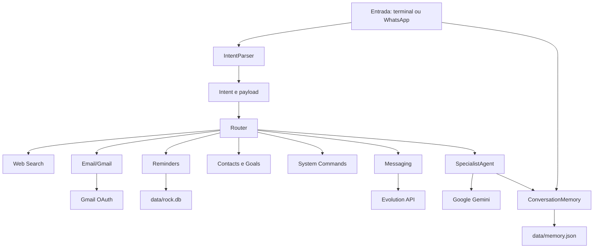

# Documentacao do Rock Assistant

Este documento descreve a arquitetura atual do Rock Assistant, a responsabilidade de cada arquivo relevante e os fluxos de uso por capacidade. O projeto pode funcionar como aplicativo local de terminal, aplicativo local com voz e servidor HTTP para integracao com a Evolution API e WhatsApp.

## 1. Visao geral

O Rock Assistant combina um interpretador de intencoes, um roteador de ferramentas, memoria local e um agente especialista baseado no Google Gemini.

As capacidades principais sao:

- conversa geral e tarefas tecnicas com Gemini;
- WhatsApp por webhook da Evolution API;
- envio, leitura e resposta de e-mails pelo Gmail;
- pesquisa web comum e busca em massa;
- lembretes locais e sincronizacao opcional com Google Calendar;
- contatos e objetivos conversacionais para confirmacao de eventos;
- comandos e diagnosticos do sistema Linux;
- entrada e saida por voz;
- memoria curta persistida em JSON e estado operacional em SQLite.

O envio de mensagens WhatsApp pelo modulo de integracao usa a Evolution API quando configurada. O modo generico de mensageria tambem possui caminhos de simulacao e deve ser verificado antes de ser tratado como uma integracao de producao.

## 2. Modos de execucao

### Terminal em texto

```bash
python -m rock_assistant.main
```

O programa le texto com `input()`, identifica a intencao, executa a ferramenta correspondente e mostra o resultado no terminal.

### Terminal em voz

```bash
python -m rock_assistant.main --voz
```

O modo de voz captura audio com STT, processa a mesma cadeia de intencao e roteamento e fala a resposta usando TTS. Se o microfone ou as dependencias de audio nao estiverem disponiveis, o programa pode voltar a aceitar texto pelo terminal.

### Webhook WhatsApp

```bash
uvicorn rock_assistant.api:app --host 0.0.0.0 --port 8000 --reload
```

O servidor FastAPI recebe eventos `messages.upsert` da Evolution API em `POST /webhook`. Mensagens do mesmo remetente sao agrupadas durante o periodo de silencio configurado antes de serem interpretadas.

### Interface grafica

O modulo `rock_gui.py` fornece a interface grafica local do projeto. A forma exata de inicializacao depende das bibliotecas e configuracoes presentes no ambiente; o nucleo continua sendo compartilhado com os modos de terminal.

## 3. Arquitetura e fluxo comum



Fluxo de uma mensagem no terminal:

1. `main.py` cria memoria, parser, especialista e roteador.
2. O usuario informa texto ou fala.
3. A mensagem do usuario e salva na memoria curta.
4. `IntentParser` identifica uma intencao e cria um `payload` estruturado.
5. `Router` chama o manipulador registrado para a intencao.
6. A ferramenta executa a acao ou `SpecialistAgent` consulta o Gemini.
7. A resposta e salva na memoria e exibida.
8. No modo de voz, `speech_formatter.py` prepara uma versao adequada para o TTS.

No webhook, `ConversationManager` acrescenta `owner_phone` ao payload e envia a resposta ao remetente pela Evolution API. Comandos locais do sistema permanecem bloqueados nesse canal.

As intencoes usadas pelo roteador incluem `search`, `reminder`, `command`, `message`, `contact`, `goal`, `email` e `general`. O parser tambem pode retornar uma intencao vazia quando nao consegue classificar a entrada.

Exemplos:

```text
busca documentacao Python
=> {"intent": "search", "payload": {"query": "documentacao Python"}}

lembre de estudar as 20:00
=> {"intent": "reminder", "payload": {"text": "estudar", "when": "as 20:00"}}

exec uname -a
=> {"intent": "command", "payload": {"command": "uname -a"}}
```

## 4. WhatsApp e Evolution API

### Fluxo

```text
Evolution API -> api.py -> ConversationManager -> IntentParser -> Router
                                                     |
                              resposta <- messaging.py <- ferramenta ou Gemini
```

1. A Evolution API envia um evento para `POST /webhook`.
2. `api.py` ignora mensagens enviadas pelo proprio bot, eventos sem remetente e mensagens sem texto.
3. O telefone e normalizado a partir do `remoteJid`.
4. Texto simples, texto estendido e legendas de imagem, video ou documento sao aceitos.
5. `ConversationManager` agrupa mensagens do remetente e aguarda silencio.
6. O texto agrupado e interpretado e roteado.
7. A resposta e enviada ao WhatsApp.

Eventos `presence.update` controlam o estado de digitacao. Enquanto o contato esta digitando, o timer de processamento e pausado.

### Arquivos envolvidos

- `rock_assistant/api.py`: cria a aplicacao FastAPI, extrai texto e remetente e trata `/webhook`.
- `rock_assistant/core/conversation_manager.py`: mantem um buffer por remetente, usa `threading.Timer`, limita o tamanho da entrada e coordena objetivos ativos.
- `rock_assistant/tools/messaging.py`: envia mensagens e presenca pela Evolution API quando configurada.
- `rock_assistant/tools/contacts.py`: normaliza telefones e resolve nomes cadastrados.
- `rock_assistant/tools/conversation_goals.py`: persiste confirmacoes de eventos e seus fatos coletados.

### Configuracao basica

```env
EVOLUTION_API_URL=http://localhost:8080
EVOLUTION_API_KEY=sua_chave_global_evolution
EVOLUTION_INSTANCE=SuporteBot
CONVERSATION_SILENCE_SECONDS=7
```

Configure o webhook da Evolution API para apontar para `http://seu-host:8000/webhook` e habilite o evento `MESSAGES_UPSERT`.

### Limites

- O webhook processa texto e legendas; ele nao implementa interpretacao completa de todos os tipos de midia.
- A entrega depende de a Evolution API estar acessivel e autenticada.
- A protecao contra comandos locais e uma regra do roteamento do canal, nao um mecanismo geral de seguranca.
- Arquivos em `evolution_api/instances/` contem estado de sessoes e nao devem ser compartilhados.

## 5. E-mail e Gmail

### Operacoes disponiveis

`rock_assistant/tools/email.py` define `GmailTool`, que suporta:

- envio de e-mail simples;
- copia e copia oculta;
- listagem por consulta Gmail;
- leitura de mensagem e corpo em texto ou HTML;
- identificacao de anexos;
- marcacao como lida;
- resposta preservando assunto, thread e cabecalhos de referencia.

Exemplos de pedidos:

```text
enviar email para pessoa@example.com, assunto: Oi, corpo: Tudo bem?
listar emails nao lidos
ler email ID
responder email ID: texto
marcar email ID como lido
```

### Autenticacao

Na primeira operacao, o OAuth2 abre o fluxo de autorizacao e salva o token localmente. O cliente OAuth deve ser salvo como `rock_assistant/data/credentials.json`; o token do Gmail fica em `rock_assistant/data/gmail_token.json`.

```env
GMAIL_TOKEN_FILE=rock_assistant/data/gmail_token.json
GMAIL_SCOPES=https://www.googleapis.com/auth/gmail.modify
GMAIL_USER_ID=me
GMAIL_MAX_MESSAGES=10
GMAIL_MONITORING_ENABLED=False
```

### Delegacao de e-mail

Pedidos como "acompanhe", "aguarde retorno" ou "tome as redeas" podem iniciar uma delegacao. `EmailDelegationManager`:

1. envia o primeiro contato;
2. salva destinatario, assunto, ids da mensagem e da thread;
3. registra o estado em `rock_assistant/data/gmail_delegations.json`;
4. consulta a thread em ciclos posteriores;
5. informa quando chega uma resposta.

O assistente nao responde nem negocia sozinho depois que uma resposta chega. Ele pede uma decisao ao usuario. O monitoramento geral permanece desativado por padrao; a delegacao possui seu proprio acompanhamento enquanto o processo estiver executando.

## 6. Pesquisa e informacao

### Pesquisa web

`rock_assistant/tools/web_search.py` realiza buscas externas com estes fallbacks:

1. DuckDuckGo por `DDGS`;
2. uma consulta simplificada;
3. API Instant Answer do DuckDuckGo;
4. API de resumo da Wikipedia em portugues.

Os resultados sao normalizados com titulo, URL e resumo. `search_web()` gera texto para o terminal; `search_web_structured()` devolve dados estruturados e controla workers, timeout e prazo global.

Exemplos:

```text
busca documentacao FastAPI
busca alvo especifico: site oficial Python asyncio
```

A busca real depende de internet e dos pacotes instalados.

### Busca em massa

`rock_assistant/tools/bulk_search.py` usa Scrapy para percorrer URLs iniciais, respeitando `robots.txt`, limite de ate dez requisicoes concorrentes, timeout de download e prazo global.

O modo e acionado por:

```text
busca em massa: https://exemplo.com
```

Scrapy precisa estar instalado. O crawler nao deve ser interpretado como uma ferramenta sem limite: ele segue apenas links configurados pela estrategia atual e descarta extensoes como PDF, ZIP e EXE.

## 7. Lembretes e calendario

### Interpretacao

`rock_assistant/core/reminder_interpreter.py` transforma linguagem natural em um `ReminderDraft`, extraindo texto, data, horario, importancia e necessidade de confirmacao.

Exemplos:

```text
lembre de estudar amanha as 14:00
me lembre de ligar para Ana, e urgente
```

### Armazenamento e sincronizacao

`rock_assistant/tools/reminders.py` grava primeiro no SQLite local em `rock_assistant/data/rock.db`. A sincronizacao opcional usa `GoogleCalendarAdapter` e OAuth2.

- Se o Google Calendar nao estiver configurado, o lembrete continua local.
- Uma data como "amanha" pode criar um evento de dia inteiro.
- Expressoes como "amanha meio dia" sao convertidas para 12:00.
- `list_pending_messages()` localiza mensagens sem horario ou vencidas.
- `mark_delivered()` registra a entrega depois que o conteudo e apresentado.

No inicio do programa, `core/startup.py` cria um briefing, anuncia pendencias urgentes e informa a existencia de outras mensagens. A mensagem so e marcada como entregue quando o conteudo e ouvido ou apresentado.

## 8. Contatos e objetivos conversacionais

### Contatos

`rock_assistant/tools/contacts.py` mantem contatos em uma tabela SQLite chamada `contacts`.

- `normalize_phone()` remove mascara e transforma JID em telefone.
- `is_phone_number()` valida uma quantidade plausivel de digitos.
- `add_contact()` grava nome, numero, descricao, e-mail e formas alternativas de chamada.
- `list_contacts()` lista os registros.
- `resolve_contact()` procura um unico contato por nome ou alias.

Os contatos podem ser usados para resolver destinatarios de mensagens sem depender de inferencia livre do modelo.

### Objetivos conversacionais

`rock_assistant/tools/conversation_goals.py` persiste objetivos ativos separados da memoria curta. O fluxo atual de `event_confirmation` permite confirmar com um contato:

- o que levar;
- o local;
- o horario.

`ConversationManager` detecta um objetivo ativo para o telefone, envia o historico ao especialista em formato JSON e atualiza os fatos coletados. Ao concluir, marca o objetivo como `completed` e avisa o proprietario com um resumo.

O modelo nao deve inventar fatos. Quando sua resposta nao contem uma pergunta valida, o gerenciador usa uma pergunta deterministica para os campos que faltam.

## 9. Comandos do sistema

`rock_assistant/tools/system_cmd.py` oferece comandos e diagnosticos locais:

- execucao de comandos com captura de saida e erro;
- timeout e tratamento de comando ausente;
- abertura de terminal grafico;
- descoberta do IP local;
- varredura limitada com `nmap` e fallback de portas.

Alguns padroes perigosos sao bloqueados, como `rm` contra a raiz, `mkfs`, `dd` para discos e fork bombs. Contudo, a execucao usa `shell=True`; a lista de bloqueios nao e uma sandbox. Use uma conta com permissoes restritas e nao exponha esse recurso a um canal nao confiavel.

## 10. Voz: STT, TTS e formatacao

### Speech-to-Text

`rock_assistant/tools/stt.py` tenta, conforme o ambiente:

1. capturar com SpeechRecognition/PyAudio;
2. usar Whisper local;
3. usar Google STT como fallback;
4. capturar com `arecord` ou `pw-record` quando PortAudio falhar.

WAVs temporarios sao removidos depois da transcricao. `get_stt()` fornece uma instancia reutilizavel.

### Text-to-Speech

`rock_assistant/tools/tts.py` usa Piper como backend preferencial, gera WAV e reproduz com `ffplay`, `mpv` ou `aplay`. Quando Piper, modelo ou player nao estao disponiveis, tenta `pyttsx3`.

Para preparar Piper:

```bash
python -m pip install piper-tts
mkdir -p models/piper
python -m piper.download_voices pt_BR-faber-medium --download-dir models/piper
```

```env
TTS_BACKEND=piper
PIPER_COMMAND=piper
PIPER_MODEL_PATH=models/piper/pt_BR-faber-medium.onnx
TTS_PLAYER=ffplay
```

### Formatacao

`rock_assistant/core/speech_formatter.py` converte operadores e estruturas em frases, remove URLs e Markdown desnecessarios e preserva o conteudo util. A resposta original continua na memoria e no terminal; apenas a copia enviada ao TTS e transformada.

## 11. Catalogo de arquivos

### Raiz

- `README.md`: orientacao resumida, incluindo inicializacao do webhook, WhatsApp e Gmail.
- `DOCUMENTACAO.md`: referencia detalhada de arquitetura, capacidades, arquivos e operacao.
- `CORRECOES_IMPLEMENTADAS.md`: registro de correcoes implementadas no projeto.
- `agy.md`: documento auxiliar do repositorio.
- `requirements.txt`: dependencias Python.
- `Dockerfile`: imagem de container; conferir o comando de entrada antes de usar em producao.
- `docker-compose.yml`: servicos de infraestrutura, incluindo Evolution API e PostgreSQL.

### Pacote `rock_assistant`

- `main.py`: ponto de entrada, registro de handlers, loops de texto/voz, limpeza de memoria e briefing inicial.
- `api.py`: aplicacao FastAPI e endpoint `POST /webhook` para Evolution API.
- `config.py`: variaveis de ambiente, caminhos, modelos, limites, credenciais e configuracao de voz.
- `rock_gui.py`: interface grafica local.

### Pacote `rock_assistant/core`

- `__init__.py`: marca o diretorio como pacote Python.
- `intent_parser.py`: classifica texto por regras ou Gemini e extrai payloads; possui `ping_gemini()` para verificacao de conectividade.
- `router.py`: associa intencoes a handlers e executa o handler escolhido.
- `specialist.py`: encapsula chamadas ao Google Gemini e inclui memoria recente no contexto.
- `memory.py`: memoria curta com persistencia em JSON e limite de mensagens.
- `conversation_manager.py`: buffer por remetente, espera por silencio, indicador de digitacao e objetivos ativos do WhatsApp.
- `reminder_interpreter.py`: interpreta datas, horarios, importancia e dados de lembretes.
- `speech_formatter.py`: cria a resposta textual adequada para sintese de voz.
- `startup.py`: saudacao e briefing de mensagens pendentes no inicio.

### Pacote `rock_assistant/tools`

- `__init__.py`: marca o diretorio como pacote e reexporta ferramentas principais.
- `web_search.py`: pesquisa DuckDuckGo/Wikipedia e enriquecimento de resultados.
- `bulk_search.py`: crawler Scrapy para busca em massa.
- `email.py`: Gmail OAuth, envio, leitura, resposta e delegacao.
- `reminders.py`: SQLite, mensagens pendentes e Google Calendar opcional.
- `contacts.py`: cadastro, normalizacao e resolucao de contatos.
- `conversation_goals.py`: persistencia de objetivos e fatos coletados.
- `messaging.py`: mensagens e presenca via Evolution API, com caminhos de simulacao quando aplicavel.
- `system_cmd.py`: comandos e diagnosticos do Linux.
- `stt.py`: captura e reconhecimento de fala.
- `tts.py`: sintese e reproducao de fala.

### Dados, modelos e runtime

- `rock_assistant/data/memory.json`: historico curto persistido.
- `rock_assistant/data/rock.db`: lembretes, contatos e objetivos conversacionais.
- `rock_assistant/data/credentials.json`: cliente OAuth do Google; sensivel.
- `rock_assistant/data/token.json`: token do Google Calendar; sensivel.
- `rock_assistant/data/gmail_token.json`: token do Gmail; sensivel.
- `rock_assistant/data/gmail_delegations.json`: estado de delegacoes de e-mail; pode conter metadados pessoais.
- `rock_assistant/logs/`: diretorio reservado para logs locais.
- `models/piper/`: pesos e metadados do modelo Piper; os arquivos podem ser grandes e nao devem ser expostos sem necessidade.
- `evolution_api/instances/`: sessoes, chaves e mapeamentos do WhatsApp; nunca compartilhar ou versionar publicamente.
- `evolution_api/postgres_data/`: volume de dados do PostgreSQL da infraestrutura.

## 12. Configuracao

As configuracoes sao carregadas por `rock_assistant/config.py`. Os nomes mais importantes sao:

```env
GEMINI_API_KEY=chave_do_gemini
GEMINI_MODEL_ROUTER=gemini-2.0-flash-lite
GEMINI_MODEL_SPECIALIST=gemini-2.0-flash
LLM_ROUTER_ENABLED=False
GEMINI_TEMPERATURE=0.2
GEMINI_TIMEOUT=30
MAX_MEMORY_MESSAGES=10
VOICE_ENABLED=True
STT_MODEL=tiny
VOICE_LANGUAGE=pt-BR
MICROPHONE_INDEX=0
MICROPHONE_NAME=
TTS_RATE=175
TTS_VOLUME=1.0
TTS_BACKEND=piper
PIPER_MODEL_PATH=models/piper/pt_BR-faber-medium.onnx
TTS_PLAYER=ffplay
GMAIL_TOKEN_FILE=rock_assistant/data/gmail_token.json
GMAIL_MAX_MESSAGES=10
GMAIL_MONITORING_ENABLED=False
CONVERSATION_SILENCE_SECONDS=7
```

Nunca coloque chaves, tokens ou credenciais diretamente neste documento ou em logs. Prefira variaveis de ambiente e arquivos locais ignorados pelo controle de versao.

## 13. Dependencias externas

As dependencias ficam em `requirements.txt`. Entre as principais estao:

- `fastapi` e `uvicorn`: servidor do webhook;
- `google-genai`: Gemini;
- `requests`, `ddgs` ou `duckduckgo-search`: pesquisa;
- `beautifulsoup4`, `pandas` e `lxml`: leitura e enriquecimento de paginas;
- `Scrapy`: busca em massa;
- `google-api-python-client`, `google-auth-*` e `google-auth-oauthlib`: Gmail e Calendar;
- `SpeechRecognition`, `openai-whisper` e PyAudio: STT;
- `piper-tts`, `pyttsx3` e players de audio: TTS.

Alguns recursos tambem dependem de programas do sistema, como `ffplay`, `mpv`, `aplay`, `arecord`, `pw-record` e `nmap`.

## 14. Testes e verificacao

Execute a suite com:

```bash
python -m pytest tests/ -v
```

Arquivos de teste atuais:

- `tests/test_battery.py`: parser, roteador e intencoes basicas;
- `tests/test_contacts.py`: contatos, telefones e aliases;
- `tests/test_conversation_manager.py`: buffer, timer e silencio;
- `tests/test_email.py`: Gmail, envio e delegacao;
- `tests/test_messaging_routing.py`: roteamento de mensagens e WhatsApp;
- `tests/test_reminder_interpreter.py`: datas, horarios e importancia;
- `tests/test_startup.py`: briefing e entrega de pendencias;
- `tests/test_web_search.py`: pesquisa, busca em massa e enriquecimento;
- `tests/test_webhook.py`: extracao e processamento do webhook.

Alguns testes ou fluxos manuais podem depender de internet, credenciais Google, microfone, player de audio, `nmap`, Scrapy ou chave do Gemini. Uma falha de ambiente deve ser diferenciada de uma falha de logica do projeto.

## 15. Pontos de atencao

1. A execucao de comandos usa `shell=True` e nao substitui isolamento, container ou permissoes restritas.
2. A integracao WhatsApp depende da Evolution API, da instancia configurada e do estado local da sessao.
3. O Gmail e o Google Calendar exigem OAuth e arquivos de credencial locais.
4. Pesquisa web, Gemini e alguns fallbacks dependem de acesso externo.
5. STT e TTS dependem de hardware, modelos e programas de audio opcionais.
6. Mensagens genericas podem retornar status simulado quando uma integracao real nao esta configurada.
7. `Dockerfile` e `docker-compose.yml` precisam ser conferidos no ambiente atual; a execucao documentada do assistente usa `rock_assistant.main` e a do webhook usa `rock_assistant.api:app`.
8. Os arquivos de dados, tokens, logs, sessoes WhatsApp e banco SQLite podem conter informacoes pessoais e nao devem ser publicados.